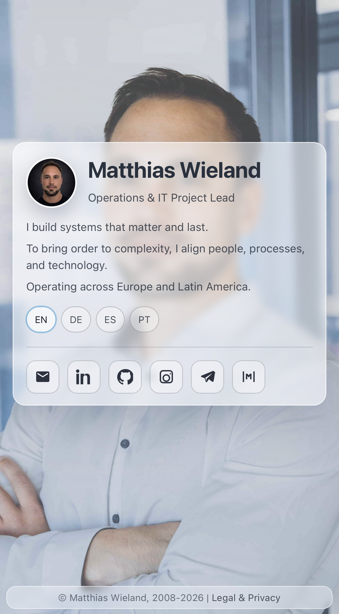

# Matthias Wieland Landing Page

Static personal website for [mwieland.com](https://mwieland.com/).

This repository contains the source for a lightweight multilingual landing page focused on a clear personal profile, direct contact links, and fast static delivery.

## What It Includes

- Responsive single-page layout for desktop and mobile
- Language variants for English, German, Spanish, and Portuguese
- Social and contact links in a compact card-based interface
- Static deployment from `public/` via `./deploy.sh`

## Live Site

[mwieland.com](https://mwieland.com/)

## Screenshots

  
  

